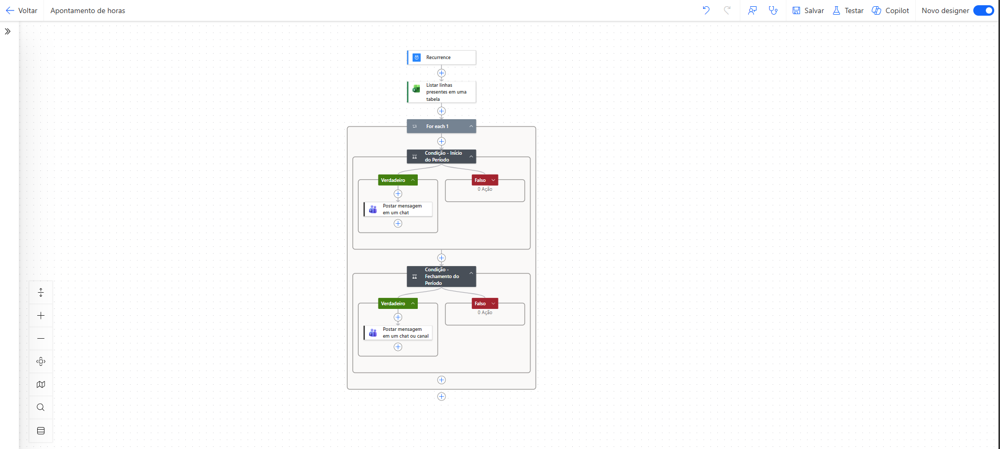

# Reminder-assistent

## Overview

Automation developed using Microsoft Power Automate to send notifications through Microsoft Teams based on data from an Excel spreadsheet.

## Workflow Overview

## Teams Notification Example

## Technologies

- Power Automate
- Microsoft Teams
- Excel Online

## Workflow

1. Read the records from an Excel table.
2. Check the configured notification data.
3. Compare the nofitication date with the current date.
4. Send and automatic notification via Teams.

## Benefits

- Reduces manual work
- Improves process consistency
- Automates recurring reminders
- Easy maintenance through Excel
